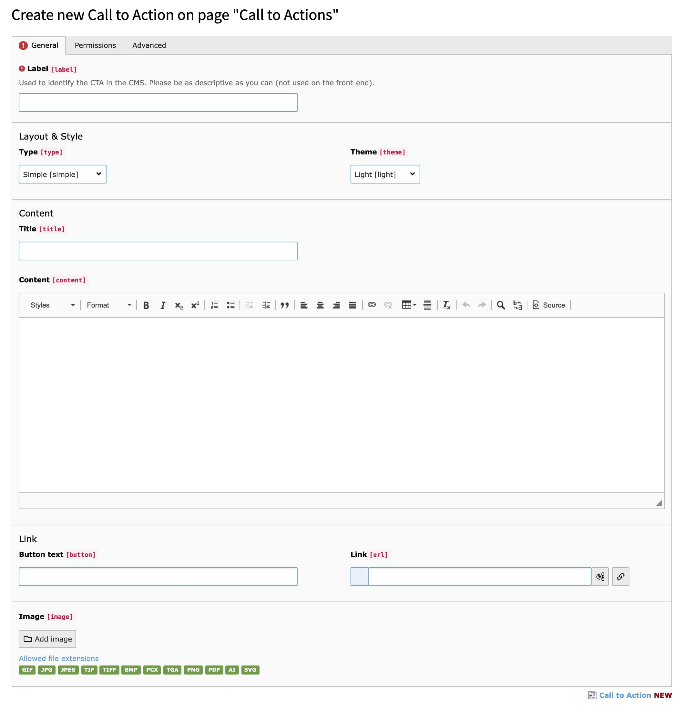

.. include:: ../Includes.txt

.. _introduction:

============
Introduction
============

.. _what-it-does:

What does it do?
================

Call to Actions (CTAs) creates a record type and plugin which allows you to make a central Call to Action repository and use them throughout the site.

Features
==================

* Make a single Call to Action and use it throughout the site
* Add a title, body, image and action link
* Uses an internal label field for identification
* Can have one or more CTA displayed with one plugin
* Update one CTA and have it update throughout the site
* Utilise the start/stop showing fields to have different CTAs show at different times

.. _screenshots:

Screenshots
===========

   A new Call to Action record
